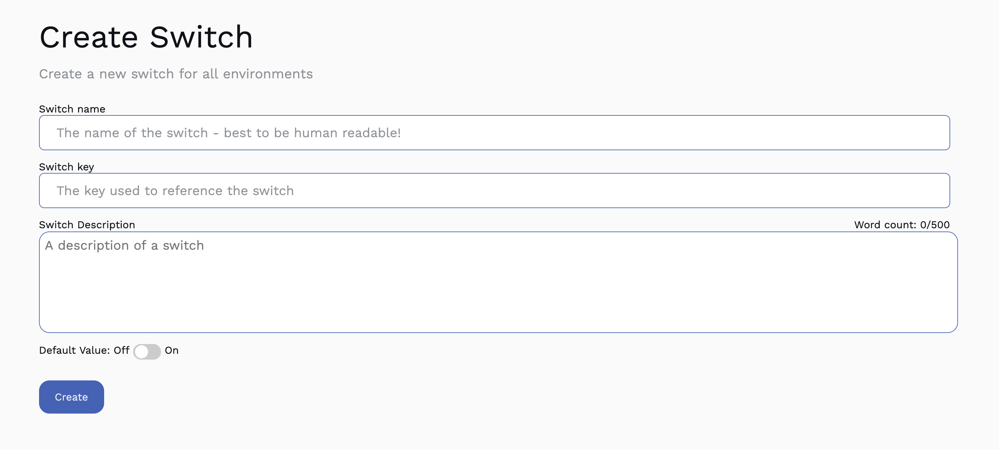
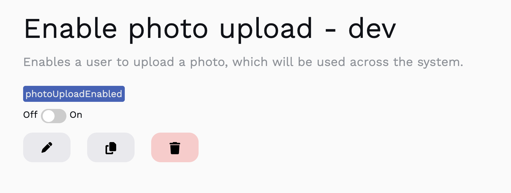

# Creating your first switch

In this doc, we'll go through how you can create your first, simple switch. A switch that will return always `true` or `false` depending on what you set the `Default Value` to.

## Prerequisite
To create your first switch, first you must ensure you've created at least one [environment](../environments).

## Creating the feature switch
Head to Dashboard, and select Feature Switches. Your default environment will be loaded. The environment doesn't matter, as the switch will be create / duplicated across all environments.

Click create, and you'll be presented with a Create page:



There are then 5 sections that need to be filled out:
1. **Switch Name**: the human readble name for a switch. We tend to go for something like "product name - Enable feature name" e.g. "User Profile Page - Enable profile photo upload".
2. **Switch Key**: this key must be unique, and will be used within your code base. We recommend making it a positive name, so something like "photoUploadEnabled", so in your code it flows better - `if(photoUploadEnabled)`. _**This cannot be changed**_.
3. **Description**: a short description of the switch. Purely to help your team understand what this switch is for.
4. **Default value**: A boolean value of the switch.

For example, if we were to create a switch around a fake new feature like being able to upload a photo, we'd fill it out like so:
1. Setting the **Switch Name** to "Enable photo upload"
2. Setting the **Switch Key** to `photoUploadEnabled`
3. Setting the **Description** to "Enables a user to upload a photo", or leave it blank
4. Setting the **Default value** to `false`. We'll be changing this later

Hit the save button, and we'll be redirected to the newly created feature switch.




## Using it in code - the Backend
### Creating an API token
Before you can do anything here, you need to have generated an [Api Token](../api-tokens).

When you create a token, make sure it has  both `Read Switch` and `List Switches` enabled and give it a name. For the sake of this tutorial, lets call it "Test Token".

### Programatically requesting a switch

There are a number of ways to request your switches value. Check out the [SDK](sdk) section for more specific implementation details for different languages.

Now we've created the switch, we need to reference it in our code:

```JavaScript
// Can set whatever environment you have - the switch exists in all of them.
const manager = new FeatureSwitchManager("{your-api-key-here}", "dev");

export const uploadPhoto = async (request) => {

  const result = await manager.getSwitchValue("photoUploadEnabled");

  if(result.value) {
    // Fill in with photo upload code
    console.log("This feature is still in the works, and currently does nothing");
  }
}
```

As you can see, we've created the manager (create one of these, and reuse it throughout your code), and then used it to get the `profilePhotoUploadEnabled` switch.
Then, if that switch returns `true`, we then handle the upload. If it's set to `false`, it does nothing.

We can now "ship" this code, as the switch is `false` for every user.
Once we're happy with the code, we can set it to `true`, and it'll become available to everyone!

And that's it! You've created your first feature switch.

While a simple "binary" switch can be useful this just scratches the surface of what you can do with Feature Switches. Check out [Advance Usage](advanced-usage) to find out more.
